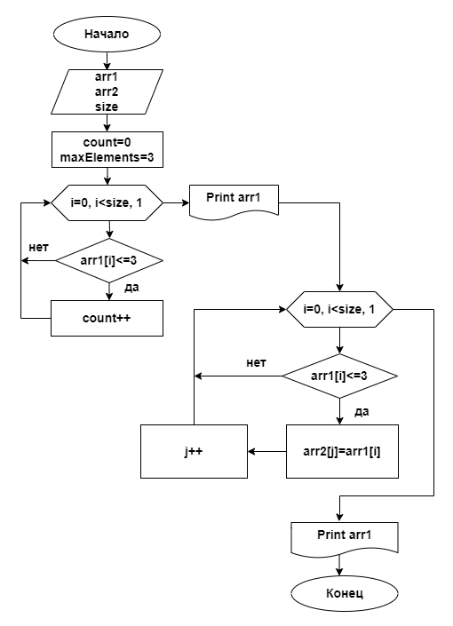

Решение:
Вначале пользователю предлагается ввести информацию сколько элементов будет входить в массив (size), а затем заполнить массив числовыми выражениями, словами или набором символов.
Задается массив arr1 размером массива обознается size, после чего вводится переменная (i), отражающая индекс элемента. Также вводится переменная count - счетчик элементов, из которых состоит массив.
На следующем этапе введенный массив arr1 выводится на экран.
Введем переменную maxElements - максимально допустимое количество символов в элементе массива. По условию задачи он равен 3, поэтому: (maxElements = 3).
Вводим элементы массива начиная с первого arr1[0], до тех пор, пока индекс [i] меньше длины массива size, прибавляя по одному.
Каждый элемент массива проверяется на соответствие условию: длинна элемента arr[i] <= maxElements. Если это условие соблюдается, то счетчик count увеличиваем на единицу. Если нет, то проверяем следующий элемент массива arr1[i+1].
Далее заполняется новый массив arr2 – в рамках цикла. Для этого снова выполняется проверка каждого элемента массива, на условие, что длина элемента массива arr1[i] больше или равна maxElements. Если условие проверки соблюдается, то элементу массива arr2[j] присваивается соответствующее значение элемента arr1[i] и он вносится в массив arr2. Если условие проверки не соблюдается, то проверяется следующий элемент из введенного нами массиваarr1[i+1].
По окончании выполнения цикла на экран выводится новый массив arr2, состоящий из элементов, удовлетворяющих условию задачи.
## Блок-схема программы:

